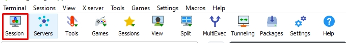
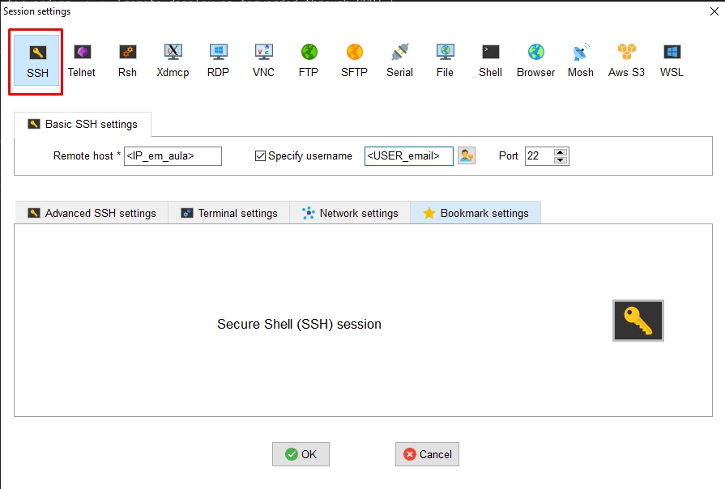
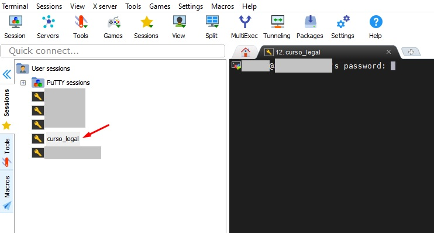
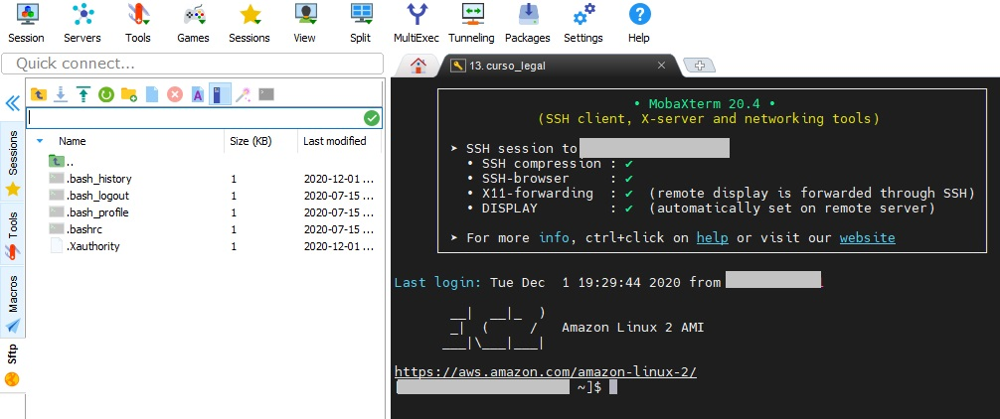

# Logando no servidor do curso

## *Windows*

Pra quem usa Windows, iremos utilizar uma ferramenta chamada **MobaXterm**
    
#### **Instalando o Moba**
- Entre no link abaixo e baixe a versão free para o seu computador
    `https://mobaxterm.mobatek.net/download-home-edition.html`
- Instale em sua máquina no path desejado

#### **Configurando o moba***

1 - Abra o MobaXterm e selecione Session



2 - Em SSH, digite o **IP HOST** que será passado em aula, junto com seu usuário, e clique em **OK**



3 - Ao adicionar a instância, dê duplo clique e coloque sua senha



4 - Você está pronto para utilizar o servidor e ter acesso, inclusive, para baixar e subir arquivos pro servidor! (mostraremos em aula como fazer).

*Spoiler: você só precisa clicar em sftp e navegar nas pastas, adicionando ou baixando arquivos*



## *Linux* ou *MAC*

1 - Abra o terminal

2 - Digite:
```
ssh <user>@<IP_em_aula>
```
3 - Digite sua senha

4 - Você está pronto pra seguir :D