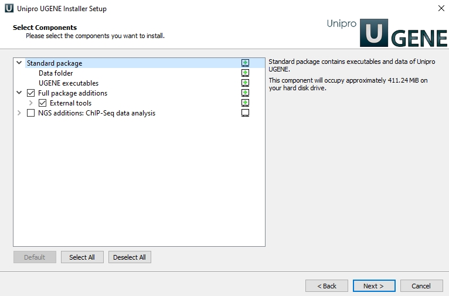

# Curadoria de montagem
#### prof. Livia Moura

## Preparando o ambiente

1 - Baixe o software GUI que iremos utilizar nas análises: **UGENE**
```
http://ugene.net/download-all_html
```

2 - Instale no seu computador o pacote adicional.


3 - Baixe os arquivos que estão no drive para seu ambiente:
```
https://drive.google.com/drive/folders/1JNRNxFMvlnMaRel_eZY4wyxwSfRBwiM4?usp=sharing
```

## SAM tags

1 - CIGAR  
```
https://samtools.github.io/hts-specs/SAMv1.pdf
páginas 7-8
```

2 - Outras TAGS
```
https://samtools.github.io/hts-specs/SAMtags.pdf
```

## Pysam 

1 - Pacote para estudo de BAM/SAM (python based)
```
https://pysam.readthedocs.io/en/latest/api.html
```